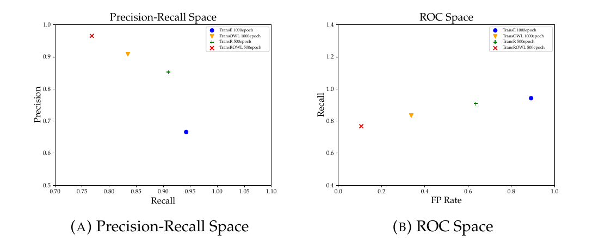
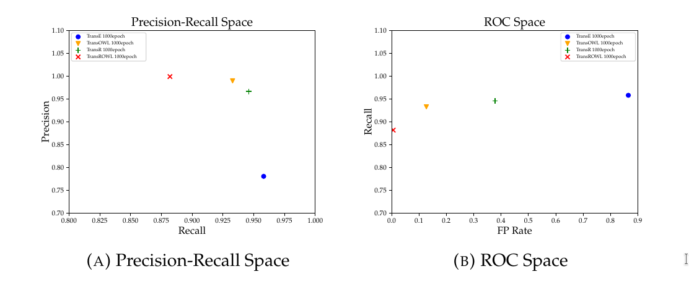
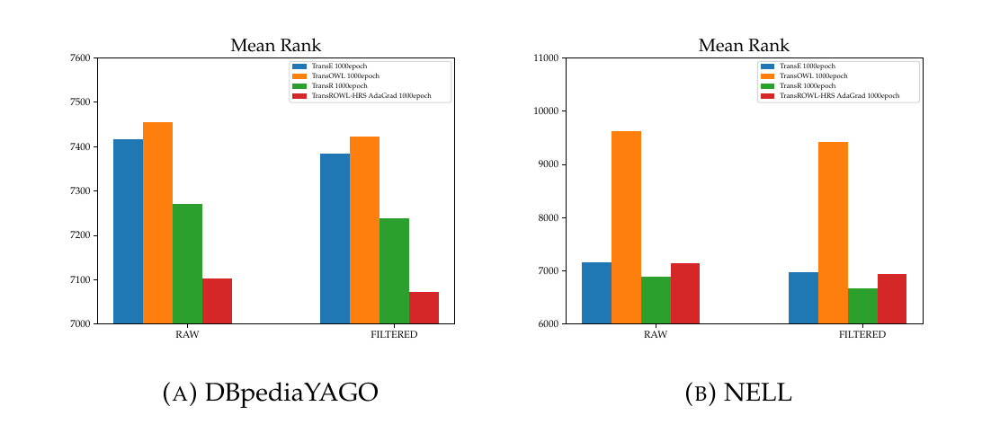

# TransROWL-HRS

This repository is related to my thesis' work, which has the purpose to verify the efficacy of different models combined together such as:
- TransE  [1]
- TransE<sup>R</sup> [9]
- TransR  [2]
- TransOWL  [3]
- HRS (Hierarchical Relational Structure) [4]
- Optimizers:
  - Stochastic Gradient Discent [5]
  - Momentum [6]
  - AdaGrad [7]
  
 The models developed, particularly <em>TransROWL</em> and <em>TransROWL-HRS AdaGrad</em>, achieve better performance in Link Prediction and Triple Classification:
  
  
  
  
  
  
  The JavaReasoner folder contains a java program which is able to generate,given a dataset, all the files necessary to run the tests.
  The JavaReasoner can be executed with those arguments:
  ```
     args[0] : ontology schema file
     args[1] : ontology data file
     args[2] : ontology data extension (example "TURTLE","N-Triple"...)
     args[3] : mode selected between "equivalentClass" "equivalentProperty" "functionalProperty" "inverseOf" "subClassOf" "rangeDomain" "DisjointWith" "classList" "merge"
     
     if "merge" is selected
     args[4] : second ontology schema file
     args[5] : ontology linking file
     args[6] : second ontology data file
     args[7] : ontology linking file extension
     args[8] : second ontology data file extension
  
  ```
  The "merge" function is useful if you need to consider more datasets that are linked together.
  
  All the files generated with JavaReasoner must be put in the same folder hierarchy as the dataset folders already available.
  In order to generate the remaining files needed, please execute in this order those other scipts:
  1. linkedDataUtils2
  2. dbpediaUtils2
  3. n-n.py
  4. linkedDataUtils
  
  <strong>Note</strong>: if the program is using multithread features compile it as: g++ myfile.cpp -o myfile -pthread -O3 -march=native <br/>
  
 Your new dataset is ready.
 Train the TransE model for initializing the embedding vectors.In this way, you will avoid overfitting.
 Train the model you prefer, specifying your dataset folder.If the model is a HRS variant, execute the k-means script. 
 Execute the test you want,choose between:
 
  - Triple Classification without the <em>typeOf</em> relation
  - Triple Classification with only the <em>typeOf</em> relation
  - Link Prediction without the <em>typeOf</em> relation
  - Link Prediction with only the <em>typeOf</em> relation
  - Link Prediction with all the relations
  
  For a better understanding of the tests' structure, please refer to [1] and to [8].
  
  ### Code contribution
  https://github.com/aditya1601/kmeans-clustering-cpp     <br/>
  Giovanni Sansaro   [3]                                     <br/>
  https://github.com/thunlp/Fast-TransX                   <br/>
  
  ### Citations
  [1] Antoine Bordes et al. «Translating Embeddings for Modeling Multi-relational Data». In: Advances in Neural Information Processing Systems 26. A cura di C.J. C. Burges et al. Curran Associates, Inc., 2013, pp. 2787–2795. URL: http ://papers.nips.cc/paper/5071-translating-embeddings-for-modeling-multi-relational-data.pdf.<br/>
  [2] Yankai Lin et al. «Learning Entity and Relation Embeddings for Knowledge Graph Completion». In: Proceedings of the Twenty-Ninth AAAI Conference on Artificial Intelligence. AAAI’15. Austin, Texas: AAAI Press, 2015, 2181–2187. ISBN:0262511290.<br/>
  [3] Giovanni Sansaro. «Tesi di Laurea, TransOWL:iniezione di conoscenza di fondo nella costruzione di embedding da knowledge graph». In: (2019).<br/>
  [4] Zhao Zhang et al. «Knowledge Graph Embedding with Hierarchical Relation Structure». In: Proceedings of the 2018 Conference on Empirical Methods in Natural Language Processing. Brussels, Belgium: Association for Computational Linguistics, 2018, pp. 3198–3207. DOI : 10.18653/v1/D18- 1358. URL: https://www.aclweb.org/anthology/D18-1358.<br/>
  [5] Sebastian Ruder.An overview of gradient descent optimization algorithms. 2016.arXiv:1609.04747 [cs.LG].<br/>
  [6] Ning Qian. «On the Momentum Term in Gradient Descent Learning Algorithms».  In:Neural  Netw.12.1  (gen.  1999),  145–151.ISSN:  0893-6080.DOI:10.1016/S0893-6080(98)00116-6.URL:https://doi.org/10.1016/S0893-6080(98)00116-6.<br/>
  [7] John Duchi, Elad Hazan e Yoram Singer. «Adaptive Subgradient Methods forOnline Learning and Stochastic Optimization». In:J. Mach. Learn. Res.12.null(lug. 2011), 2121–2159.ISSN: 1532-4435. <br/>
  [8] Richard Socher et al. «Reasoning With Neural Tensor Networks for Knowledge Base Completion». In: Advances in Neural Information Processing Systems 26.A cura di C. J. C. Burges et al. Curran Associates, Inc., 2013, pp. 926–934. URL :http://papers.nips.cc/paper/5028- reasoning- with- neural- tensor-networks-for-knowledge-base-completion.pdf. <br/>
  [9] Pasquale Minervini et al. «Regularizing Knowledge Graph Embeddings via Equivalence and Inversion Axioms». In: Machine Learning and Knowledge Discovery in Databases. A cura di Michelangelo Ceci et al. Vol. 10534. Cham: SpringerInternational Publishing, 2017, pp. 668–683. ISBN: 9783319712482 9783319712499.DOI : 10.1007/978-3-319-71249-9_40. URL : http://link.springer.com/10.1007/978-3-319-71249-9_40. <br/>

 
