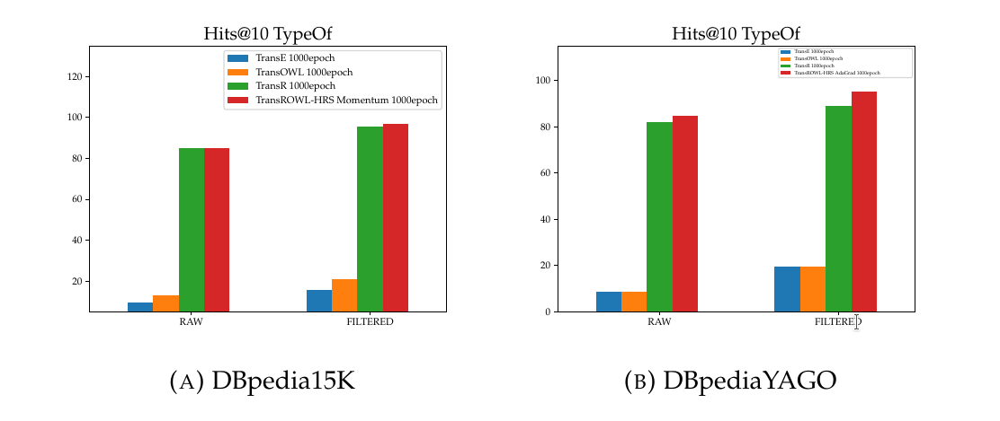
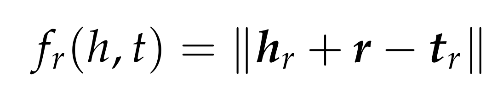

# TransROWL-HRS

This repository is related to my thesis' work, which has the purpose to verify the efficacy of different models combined together such as:
- TransE  [1]
- TransE<sup>R</sup> [9]
- TransR  [2]
- TransOWL  [3]
- HRS (Hierarchical Relational Structure) [4]
- Optimizers:
  - Stochastic Gradient Discent [5]
  - Momentum [6]
  - AdaGrad [7]
  
 The models developed, particularly <em>TransROWL</em> and <em>TransROWL-HRS AdaGrad</em>, achieve better performance in Link Prediction and Triple Classification:
  
  - DBpedia100K [10] (The dataset has been modified compared to his original version [10])
  
  - DBpedia15K [11] (The dataset has been modified compared to his original version [11])
  
  
  
  

  ### Instructions
  The JavaReasoner folder contains a java program which is able to generate,using a reasoner on a given dataset, all the files necessary to run the tests.
  The JavaReasoner makes use of the Apache Jena Framework, more informations at https://jena.apache.org/getting_started/index.html .
  The JavaReasoner can be executed with those arguments:
  ```
     args[0] : ontology schema file
     args[1] : ontology data file
     args[2] : ontology data extension (example "TURTLE","N-Triple"...)
     args[3] : mode selected between "equivalentClass" "equivalentProperty" "functionalProperty" "inverseOf" "subClassOf" "rangeDomain" "DisjointWith" "classList" "merge"
     
     if "merge" is selected
     args[4] : second ontology schema file
     args[5] : ontology linking file
     args[6] : second ontology data file
     args[7] : ontology linking file extension
     args[8] : second ontology data file extension
  
  ```
  The "merge" function is useful if you need to consider more datasets that are linked together.
  
  All the files generated with JavaReasoner must be put in the same folder hierarchy as the datasets' folders already available.
  In order to generate the remaining files needed, please execute in this order those other scipts:
  1. linkedDataUtils.cpp
        - it is necessary to associate to every entity and relation an id, and to generate training set, validation set and test set.
  2. dbpediaUtils.cpp
        - it is necessary to associate every entity to the classes which it belongs to, and to associate the range and the domain of every relation to the corrisponding ids.
  3. n-n.py
        - it is necessary to distinguish the different types of relations: 1-to-1, 1-to-n, n-to-1, n-n.
  4. false2id.cpp
        - it is necessary to generate the false triples for the Triple Classification task, it uses the criterion described in [3].
  
  <strong>Note</strong>: if the program is using multithread features compile it as: g++ myfile.cpp -o myfile -pthread -O3 -march=native <br/>
  
 Your new dataset is ready.
 Train the TransE model for initializing the embedding vectors.In this way, you will avoid overfitting as stated in [2].
 Train the model you prefer, specifying your dataset folder.If the model is a HRS variant, execute first the k-means.cpp script. 
 Execute the test you want,choose between:
 
  - Triple Classification without the <em>typeOf</em> relation
  - Triple Classification with only the <em>typeOf</em> relation
  - Link Prediction without the <em>typeOf</em> relation
  - Link Prediction with only the <em>typeOf</em> relation
  - Link Prediction with all the relations
    
 For a better understanding of the tests' structure, please refer to [1] and to [8]. If you are testing on dataset "DBpedia15K" or "DBpedia100K" use the "K" variant of the models due to different formatting of the datasets' files.<br/>
 <b>If you want the trained models used in this thesis, please send me an email at<b/> test48279@gmail.com <br/>
 
  ### Example of a test
  Let's suppose that we want to train and test a model, let's say <em>TransROWL-HRS</em>, on the dataset "data" with the ontology schema "schema". Here is what you need to do:
  1. Run the main.java program in the folder JavaReasoner with the arguments :  ``` "schema" "data" "TURTLE" "equivalentClass"```. 
  Repeat such command for every mode such as ```"equivalentProperty" "functionalProperty" "inverseOf"```.
  2. Create a new folder "DATASET" for the dataset "data". Take every obtained file and place it with the same folder hierarchy of each other dataset such as "DBpedia15K".
  3. Compile linkedDataUtils.cpp , dbpediaUtils.cpp and false2id.cpp with the command ``` g++ myfile.cpp -o myfile ``` (change the directory paths if necessary).
  Execute these program in the following order : linkedDataUtils.cpp , dbpediaUtils.cpp , n-n.py , false2id.cpp.
  4. Place every obtained file in the "DATASET" folder with the same folder hierarchy of each other dataset such as "DBpedia15K".
  5. In order to train the model <emp>TransROWL-HRS</emp>, we first need to train TransE to obtain the embedding vectors to inizialize the vectors of <emp>TransROWL-HRS</emp>.
  Let's train then TransE compiling his program with the following command ``` g++ myfile.cpp -o myfile -pthread -O3 -march=native ```  after changing the directory path to our dataset folder "DATASET". We can train the model in a parallel way specifing the number of threads before compiling.
  6. Place the obtained files of the entity vectors and relation vectors in the dataset folder "DATASET".
  7. Compile the program "kmeans.cpp" with the command ``` g++ myfile.cpp -o myfile ``` and run it with the entity vectors file and cluster's number as arguments.
  8. Place the file "cluster.txt" in the same folder of <emp>TransROWL-HRS</emp> file.
  9. Compile the model <emp>TransROWL-HRS</emp> with the command ``` g++ myfile.cpp -o myfile -pthread -O3 -march=native ```.
  Run the model <emp>TransROWL-HRS</emp>.
  10. Place the obtained files of the entity vectors, relation vectors and projection matrix in the dataset folder "DATASET".
  11. Compile the test file you want to execute, let's consider the test of Link Prediction with only the <emp>typeOf</emp> relation.
  Compile the test file "Link_Prediction_transR_TypeOf.cpp" with the command ``` g++ myfile.cpp -o myfile -pthread -O3 -march=native ```. Execute the program.
  12. You will obtain the text file with the results.
  13. If you want to execute a test of triple classification on the <emp>typeOf</emp> relation, use the file "triple_class_typeOf_ROWL_1000epoch.py".
  14. You will obtain the text file with the results.
 
 In the "Graphs_Charts" folder you will find all the results from every test organized in a tabular form such as:
 
  
All the results in the folders "Graphs_Charts", "Link_Prediction" e "Triple_Classification" are obtained considering models trained with those settings:
- Shared Settings:
  - learning rate = 0.001
  - minibatch size = 50
  - entity vector dimension = 100
  - relation vector dimension = 100
  - epoch = 250 | 500 | 1000
- TransROWL<sup>R</sup> Loss Function Parameters:
  - Λ<sub>1</sub>=Λ<sub>2</sub>=Λ<sub>3</sub>=Λ<sub>4</sub>=Λ<sub>5</sub>=Λ<sub>6</sub>=0.1
- TransROWL Loss Function Parameters:
  - Λ<sub>1</sub>=1
  - Λ<sub>2</sub>=1
  - Λ<sub>3</sub>=0.1
  - Λ<sub>4</sub>=0.01
- TransROWL-HRS Loss Function Parameters:
  - Λ<sub>1</sub>=1
  - Λ<sub>2</sub>=1
  - Λ<sub>3</sub>=0.1
  - Λ<sub>4</sub>=0.01
  - Λ<sub>c</sub>=0.00001
  - Λ<sub>r</sub>=0.0001
  
  ### Mathematical Formulation
  
  - <b>TransROWL</b><br/>
  <br/>
  <br/>
  <br/>
  <br/>
  
  - <b>TransROWL<sup>R</sup></b><br/>
  <br/>
  <br/>
  <br/>
  
  - <b>TransROWL-HRS</b><br/>
  <br/>
  <br/>
  <br/>
  <br/>
  <br/>
  
  
  ### Code contributions
  https://github.com/aditya1601/kmeans-clustering-cpp     <br/>
  Giovanni Sansaro   [3]                                     <br/>
  https://github.com/thunlp/Fast-TransX                   <br/>
  https://github.com/iieir-km/ComplEx-NNE_AER/tree/master/datasets/DB100K     <br/>
  https://github.com/nle-ml/mmkb/tree/master/DB15K    <br/>
  (The datasets DB100K and DB15K have been modified compared to their original version [10] [11])
  
  ### Citations
  [1] Antoine Bordes et al. «Translating Embeddings for Modeling Multi-relational Data». In: Advances in Neural Information Processing Systems 26. A cura di C.J. C. Burges et al. Curran Associates, Inc., 2013, pp. 2787–2795. URL: http ://papers.nips.cc/paper/5071-translating-embeddings-for-modeling-multi-relational-data.pdf.<br/>
  [2] Yankai Lin et al. «Learning Entity and Relation Embeddings for Knowledge Graph Completion». In: Proceedings of the Twenty-Ninth AAAI Conference on Artificial Intelligence. AAAI’15. Austin, Texas: AAAI Press, 2015, 2181–2187. ISBN:0262511290.<br/>
  [3] Giovanni Sansaro. «Tesi di Laurea, TransOWL:iniezione di conoscenza di fondo nella costruzione di embedding da knowledge graph». In: (2019).<br/>
  [4] Zhao Zhang et al. «Knowledge Graph Embedding with Hierarchical Relation Structure». In: Proceedings of the 2018 Conference on Empirical Methods in Natural Language Processing. Brussels, Belgium: Association for Computational Linguistics, 2018, pp. 3198–3207. DOI : 10.18653/v1/D18- 1358. URL: https://www.aclweb.org/anthology/D18-1358.<br/>
  [5] Sebastian Ruder.An overview of gradient descent optimization algorithms. 2016.arXiv:1609.04747 [cs.LG].<br/>
  [6] Ning Qian. «On the Momentum Term in Gradient Descent Learning Algorithms».  In:Neural  Netw.12.1  (gen.  1999),  145–151.ISSN:  0893-6080.DOI:10.1016/S0893-6080(98)00116-6.URL:https://doi.org/10.1016/S0893-6080(98)00116-6.<br/>
  [7] John Duchi, Elad Hazan e Yoram Singer. «Adaptive Subgradient Methods forOnline Learning and Stochastic Optimization». In:J. Mach. Learn. Res.12.null(lug. 2011), 2121–2159.ISSN: 1532-4435. <br/>
  [8] Richard Socher et al. «Reasoning With Neural Tensor Networks for Knowledge Base Completion». In: Advances in Neural Information Processing Systems 26.A cura di C. J. C. Burges et al. Curran Associates, Inc., 2013, pp. 926–934. URL :http://papers.nips.cc/paper/5028- reasoning- with- neural- tensor-networks-for-knowledge-base-completion.pdf. <br/>
  [9] Pasquale Minervini et al. «Regularizing Knowledge Graph Embeddings via Equivalence and Inversion Axioms». In: Machine Learning and Knowledge Discovery in Databases. A cura di Michelangelo Ceci et al. Vol. 10534. Cham: SpringerInternational Publishing, 2017, pp. 668–683. ISBN: 9783319712482 9783319712499.DOI : 10.1007/978-3-319-71249-9_40. URL : http://link.springer.com/10.1007/978-3-319-71249-9_40. <br/>
  [10] Boyang Ding et al. «Improving Knowledge Graph Embedding Using Simple Constraints». In: Proceedings of the 56th Annual Meeting of the Association for Computational Linguistics (Volume 1: Long Papers). Melbourne, Australia: Association for Computational Linguistics, lug. 2018, pp. 110–121. DOI : 10.18653/v1/P18-1011. URL : https://www.aclweb.org/anthology/P18-1011. <br/>
  [11] Ye Liu et al. MMKG: Multi-Modal Knowledge Graphs. 2019. arXiv: 1903.05485[cs.AI].


 
